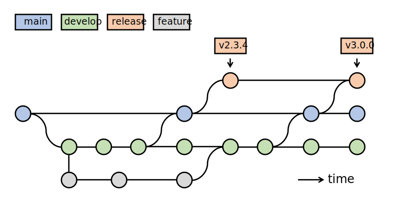

# Development process of the Accellera SystemC implementation

This document focuses on the technical aspects related to the development
of the SystemC implementation.  Legal and formal procedures are documented
at https://accellera.org/about/policies-and-procedures.

## Repository setup

The central source code repository of the Accellera SystemC reference
implementation is hosted in two [Git][1] repositories at [GitHub][2].

The **public** repository can be found at:

 * https://github.com/accellera-official/systemc

A **private** repository for Accellera members can be found at:

 * https://github.com/OSCI-WG/systemc

To obtain access to the private repository and the [`OSCI-WG` organization][3]
in general, members of the Accellera SystemC Language Working Group (LWG) can
contact the LWG chair at <mailto:lwg-chair@lists.accellera.org>
including their GitHub account name.

>  *Note:*
>  Using an explicit name of the 'remote' (`-o osci-wg`) is recommended
>  to allow using the default remote name `origin` for a personal fork
>  where you can push your changes by default, see [below](#basic-branch-setup).

Comprehensive documentation about [Git][1], a distributed version control
system, can be found in the [Pro Git book][4], also available online.
Since Git is 'distributed', it is a very natural choice for the distributed
development process needed for collaboratively evolving the reference
implementation of SystemC.

### Relationship between public and private repositories

The **public** repository contains the latest development version of the
Accellera SystemC reference implementation, including bug fixes and other
capabilities approved and released by the SystemC Language Working Group.

>  *Note:*
>  The development version in the main branch might differ from the latest
>  [released][9] or [tagged][10] versions.  For the latest stable version,
>  please use a release or tag.

The **private** repository contains features or enhancements under development
by the SystemC Language Working Group.

Please check the [CONTRIBUTING][5] guidelines how to join Accellera and its
working groups to contribute to the development of SystemC.

### Creating a personal fork

In order to contribute changes to the different repositories, it is
recommended to create personal (or company-based) [forks][6] of the
repositories on GitHub and push the proposed changes (bugfixes,
features, ...) there.  Details of the intended workflow are described
in the next [section](#basic-branch-setup).
It is convenient to add this GitHub fork as a remote to your local
clone of the repository:

      cd <repo>/
      git remote add origin git@github.com:<your-account>/<repo>.git
      git branch --set-upstream main origin/main

Any changes can then be pushed to GitHub using:

      git push [options] [<repository>] [<refspec>...]

 * If you omit the `<repository>`, the default destination is
   the remote of the current branch (or `origin`).
 * The `<refspec>` basically follows the format
    `<local-branch>:<remote-branch>`, or just `<branch>`, if
   both are the same.
 * Omitting the `<refspec>` pushes all branches with 'matching'
   remote branches to the repository.

A basic cheat sheet containing the an overview of the general
Git commands and workflow can be found [online][7].

## Development flow

This section explains the development flow for both **public** and
**private** repository.

### Basic branch setup

The following branches exist in a SystemC repository:

* **main**

  The latest and greatest `HEAD` of the SystemC development.
  This is where all finalized and approved features and fixes go.
  The aim is to keep this branch identical between the **pubic** and
  **private** repository.

* **develop**

  This branch is used for development and testing of enhancements,
  new features and fixes which are not yet finalized and approved.
  The aim is to keep this branch identical between the **pubic** and
  **private** repository, however, the branch in the **private** repository
  might be ahead of the **pubic** branch because of some LWG specific
  developments.

* **release**

  This branch is used to create the release tarballs, both internal
  and public snapshots, typically based on the `main` branch.
  The aim is to keep this branch identical between the **pubic** and
  **private** repository.

In addition, these repositories may contain additional branches for dedicated
feature developments, but it is expected that these branches are merged into
the `main` or `develop` branch.

For the **regressions**, the `release` branch is more or less just a pointer
to the latest revision of a snapshot (or release).  It is still useful
to keep a named branching point, in case of required hotfixes.

For the **core library**, the `release` branch is to be different from the
`main` branch.  The idea is to fully track the contents of the released
tarball.  This requires the following changes compared to the `main`
branch:

  - The Automake generated files are added to this tree.
  - Accellera internal files are stripped
    (`.gitignore`, internal documentation, ...).

To prepare a release, the `main` branch would then be merged into the
`release` branch, the Automake files would be updated (if necessary) and
the clean working tree could be used as baseline for the tarball (e.g.,
via `git-archive(1)`).  Details are described in the next section
[release management](#release-management).  The history of the (core library)
repostitory could then look like shown in the following graph
(time progresses upwards):

If more sophisticated version branches are needed, a development
model similar to the well-known ["successful branching model"][12]
can be deployed.  Not all aspects of this model are expected to
be needed for the SystemC implementation, as we usually
maintain only a single (i.e., the latest) public release of the
kernel.

### Adding a feature (set)

The development of a new contribution in form of a feature or a
complex bug fix is best done in a new feature branch, which is
forked and checked out from the Accellera `develop` branch:

      git checkout -b <company>-<feature-xyz> develop

Then code up the new contribution.  Please try to facilitate code
review by other Accellera members by logically grouping your changes into
one commit per addressed issue. For the commit messages, please
consider to follow these suggestions:

>  *Note:* **Commit messages**
>
>  Though not required, it's a good idea to begin the commit message with
>  a single short (less than 50 character) line summarizing the change,
>  followed by a blank line and then a more thorough description.  Tools
>  that turn commits into email, for example, use the first line on the
>  `Subject:` line and the rest of the commit in the body.

> *Note:* **Sign-off procedure for commits**
>
> In order to document that contributions are submitted under the
> Apache-2.0 license (see `LICENSE`), a sign-off procedure is
> defined in the [contributing guidelines][5].

During the development of the contribution, the `develop` branch may
receive other commits.  In that case, consider rebasing the commits in
your feature branch onto the `HEAD` of the `develop` branch to keep the
history clean.  Once the contribution is ready for review by the
working group, push the feature branch in your fork of the respective
repository on GitHub:

      git push <your-github-fork-remote-name> <company>-<feature-xyz>

Then, send a [pull request][8] either manually or via [GitHub][8] to
initiate the code review by the working group members.  The summary
can be manually generated by

      git request-pull develop git@github.com/<account>/<repo>.git \
              <company-feature-xyz>

to be sent to the LWG reflector.

To review the proposed contributions, one can either browse the
repository at GitHub, or add the remote location to a local
clone of the repository

      # add the fork to your set of "remotes"
      git remote add <remote-name> git@github.com/<account>/<repo>.git
      git fetch  <remote-name>

      # examine differences
      git diff develop..<remote-name>/<company-feature-xyz>
      git log <remote-name>/<company-feature-xyz>

After the contribution is accepted, it will be merged into the working group's
`develop` branch by the responsible source code maintainer.  This should
be done with an explicit *merge commit*, to keep the individual
contributions separated:

      git merge --no-ff --log \
         <remote-name>/<company-feature-xyz>

Instead of fully merging the contribution, the maintainer may choose
to cherry-pick individual commits or to rebase the feature branch on
an intermittently updated `develop`.  He may also request additional
changes to be done by the submitter.  In that case, the submitter may
need to merge recent changes to the `develop` branch into his feature
branch before carrying out the requested changes.

After the contribution has been fully merged into `develop`, the
feature branch in the local and Github fork may be deleted.

      git branch -d <company-feature-xyz>      # delete local branch
      git push  origin :<company-feature-xyz>  # delete remote branch

### Maintaining a private (set of) branches

Vendors may be interested in maintaining their own, in-house flow
to align the internal development of a derived SystemC implementation,
while being able to pick fixes from the Accellera Working Group's tree
(and hopefully) contributing fixes and features back to the reference
implementation.

For this purpose members may employ the already mentioned ["successful
branching model"][12] by Vincent Driessen.  The vendor can branch its
own development branch, e.g., `develop-<vendor>` from the already
tracked working group development branch `develop` in his clone of the LWG
repository.  The vendor is then able to integrate commits on the LWG
development branch by merging it into his his vendor development
branch.

Bug fixes to be contributed back to the LWG consist usually of one or
several isolated commits.  They need to be cherry-picked from the
vendor's development branch into a new branch created from the LWG
development branch:

      git checkout -b <vendor>-fix-<bug> origin/develop
      git cherry-pick <commit>...

Once, the bug fix branch is ready, it should be pushed into the
vendor's github account and a pull request created, as described in
the [feature branch section](#adding-a-feature-set).

A new feature consists usually of a series of commits developed in a
dedicated feature branched of the vendor's or LWG's development
branch.  Only in the first case, a rebase on the top of the WG's
development branch is necessary.  To this end, branch first from the
feature branch:

      git checkout -b <vendor>-<new-feature> <private-feature-branch>
      git rebase [-i|--interactive] --onto origin/develop develop-<vendor>

Once, the bug fix branch is ready, it should be pushed into the
vendor's github account and a pull request created, as described in
the [feature branch section](#adding-a-feature-set).

## Versioning scheme

In general, the versioning pattern for the SystemC/TLM reference
implementation follows the scheme defined in IEEE Std. 1666-2023 (8.6.5),
based on `Major.Minor.Patch` numbers and a date (for prereleases).

*Note:* In general, no compatibility guarantees are attached to these version
        numbers, not even for PoC implementation itself, to avoid burdens
        across different SystemC implementations.

The individual parts of the SystemC/TLM versions reported via the corresponding
header files should be  be handled according to the following criteria:

 * Update **major version** only together with
   * IEEE Standard 1666 update
   * and/or major new language features (e.g., in pre-releases for IEEE update)
 * Update **minor version** for new Accellera standard release
   * Significant language extension proposals to be added to next IEEE release
 * Update **patch version** for minor API changes
 * Update `SYSTEMC_VERSION` date macro after every pull-request merge
   * ISO8601 date format (YYYYMMDD)
   * Done by the PoC maintainers
 * The versions of SystemC and TLM are incremented separately
   * SystemC (`src/sysc/kernel/sc_ver.h`)
   * TLM (`src/tlm_core/tlm_2/tlm_version.h`)

*Note:* Changes only affecting documentation, examples, or the build system
        should not lead to a change of the version
        (not even `SYSTEMC_VERSION` macro).

The overall release date (see [next section](#release-management)) of the
PoC release tarball should reflect the date of the archive creation.

## Release management

To prepare a new release tarball, along with a tagged release at GitHub,
the following set steps are to be performed by the maintainer

1. **Merge enhancements, new features and fixes to be released**

   The latest enhancements, features and fixes are available in the
   `develop` branch. The LWG should decide which features are merged
   into the `main` branch, to make them part of a release.

   The maintainer will merge one or more commits from the `develop` branch
   into the `main` branch.

2. **Prepare the release in the `main` branch**

   Before creating a release snapshot, the documentation and version
   information in the package should be updated within the `main`
   branch.  This includes files like
   - `RELEASENOTES.md`, `README.md`, `INSTALL.md`
   - [Version headers](#versioning-scheme)

   During the release preparation phase, other functional changes
   should not be added/merged to the `main` branch.

3. **Update the `release` branch**

        # switch to release branch
        git checkout release

        # merge main branch
        git merge --no-commit main
        git rm <new-internal-file...> # drop new or changed "private" files
        git commit -m "merge main branch for x.x.x release"

        *NOTE:* `.gitignore` has to be removed in this branch otherwise
                `Makefile.in`` files are missing in the commit as well
                as in the subsequent git archive step.

4. **Update the Autoconf (and other auto-generated) files**

        autoreconf -if # or config/bootstrap
        git add -u     # add changed files
        git status     # check for untracked files
        git add <new files to distribute>
        git commit -m "update autogenerated files for x.x.x release"

5. **Tag the release revision**

   In order to keep track of the release snapshots, the revisions used
   for creating the release tarballs should be marked with an *annotated*
   and optionally signed Git tag.

        # git tag -a -m "<package> <version>" <version> <refspec>
        git tag -a -m "SystemC 3.0.0" 3.0.0 release

   The tagname should contain the `<version>`, following the versioning rules
   in IEEE Std. 1666-2023.  There are three standard formats:
   * `x.x.x_beta_<isodate>` for beta/internal versions
   * `x.x.x_pub_rev_<isodate>` for public review versions, and
   * `x.x.x` for public release versions.

   > *NOTE:* The tag should be on the `release` branch, to enable the
   > automated tarball creation in the next step.

6. **Create the release tarball**

   `git archive` can then be used to create the release tarball.
   `git describe` can be used to obtain the correct tarball name
   based on the current tag.

        PACKAGE="`basename $(git rev-parse --show-toplevel)`" # or directly 'systemc'
        VERSION="`git describe release`"
        git archive -o ${PACKAGE}-${VERSION}.tgz \
                    --prefix=${PACKAGE}-${VERSION}/ release

   > *NOTE:* Even without a tag, a quick-shot release of the
   >         release branch can be generated this way.

7. **Publish the release**

   Upload the archive to the LWG area for internal review
   and push the changes to the GitHub **public** and/or **private**
   repositories.

        git push osci-wg main release <version>
        git push accellera-official main release <version>

   > *NOTE:* The tag needs to be pushed explicitly.

   > *NOTE:* For each tag pushed to the GitHub repository, the corresponding
             release archive can be downloaded from GitHub directly via
             `https://github.com/osci-wg/systemc/releases/tag/<version>` or
             `https://github.com/accellera-official/systemc/releases/tag/<version>`

## Issue tracking

Open issues (bugs, cleanups, features) related to the reference
implementation of SystemC/TLM are tracked via GitHub:

 * <https://github.com/OSCI-WG/systemc/issues>

Some issues might be reported against the public repositories as well:

 * <https://github.com/accellera-official/systemc/issues>

> *NOTE:* For issues discussed in the LWG, the internal issue tracker is preferred.
          An internal issue clone will be added for publicly reported issues.

> *NOTE:* To distinguish between the two different trackers, issue references
          in commit messages or pull-requests should include the repository
          (`osci-wg/systemc#<no>`, `accellera-official/systemc#<no>`).

Issues are grouped (by using labels) in the following categories for
different parts of the implementation:

 * `core`           - SystemC core language, i.e. everything in `sc_core`
 * `datatypes`      - SystemC data-types, i.e. in `sc_dt`
 * `tlm`            - TLM-1.0, TLM-2.0
 * `infrastructure` - build system(s), scripts, etc.

Additional labels are used to classify issues according to their
severity (10 highest), according to the following guidelines:

 * `10-critical`
   Show-stoppers that must be fixed, affects all (or at least most)
   platforms and violates fundamental specifications for most applications.

 * `09-serious`
   At least one of the explicitly supported platforms is affected and
   causes significant problems for many applications.

 * `06-medium`
   Covers an area, where the standard may not be clearly specified.
   May require changes to external/standard API.

 * `05-feature`
   New feature proposal, beyond the current standard.  Includes internal
   (and external, providing adoption by the IEEE P1666 working group)
   API changes.

 * `04-errata`
   Inconvenience (errata) for users of many platforms, workaround available.
   Solution may require internal API changes.

 * `02-documentation`
   Documentation inconsistency or insufficiency (e.g., whitepaper unclear
   or misleading), no code changes.

 * `01-inconvenience`
   Inconvenience (workaround available), for some platforms
   (e.g. users of Visual Studio 2003)

 * `00-cosmetic`
   Changes addressing performance or clarity of implementation,
   no API changes.

The discussion on issues usually starts on the LWG reflector or during the
LWG meetings.  After an initial consensus on the "validity" of the issue,
the issue is added to the issue tracking system, a classification is done
(including a target milestone), and preferably a responsible person is
assigned.

## Changelog

* 2024-02-27
  * rename master into main
  * introduce branch develop. Remove branch public
  * update git branches picture
  * update development flow description

* 2024-02-19
  * fix typos
  * update names of references
  * links replaced by https where possible

* v3.0 (2024-02-16)
  * Update explanation and use model of public and private repositories
  * Remove separate repositories for regression tests

* v2.2 (2019-11-10)
  * Fix link to policies and procedures
  * Add reference to sign-off process described in `CONTRIBUTING`

* v2.1 (2019-04-23)
  * Update information about public repositories and their relation
    to the WG-internal repositories.

* v2.0 (2018-10-01)
  * Reorganize contents between `CONTRIBUTING` and `DEVELOPMENT`
  * Add information about public repositories
  * Formatting fixes and cleanups

* v1.1 (2015-08-23)
  * Add versioning scheme section
  * Dropped obsolete `pristine-tar` section
  * Changed "ASI" to Accellera throughout the document
  * Updated contact information

* v1.0 - Development flow implemented at GitHub (2013-06-20)
  * Issue tracking documented

* v0.9 - Initial proposal to the Accellera SystemC LWG (2012-09-25)
  * To be discussed during the October LWG phone conference

## Authors of this document

Lynn Bannister, Martin Barnasconi, Mark Burton, Philipp A. Hartmann, Torsten Maehne

 [1]: https://git-scm.com "Git version control system"
 [2]: https://github.com
 [3]: https://github.com/osci-wg "Accellera WG GitHub organization"
 [4]: https://git-scm.com/book "Pro Git Book"
 [5]: ../CONTRIBUTING.md "Contriubting to SystemC"
 [6]: https://help.github.com/articles/fork-a-repo
 [7]: http://zrusin.blogspot.de/2007/09/git-cheat-sheet.html "Git Cheat Sheet"
 [8]: https://help.github.com/articles/using-pull-requests "Using Pull Requests - github:help"
 [9]: https://github.com/accellera-official/systemc/releases
 [10]: https://github.com/accellera-official/systemc/tags
 [12]: https://nvie.com/posts/a-successful-git-branching-model/ "'A successful Git branching model' by Vincent Driessen"